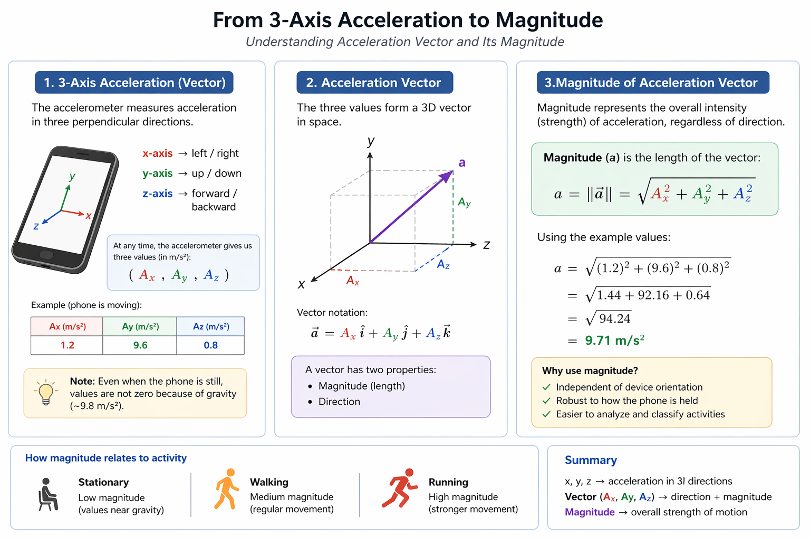
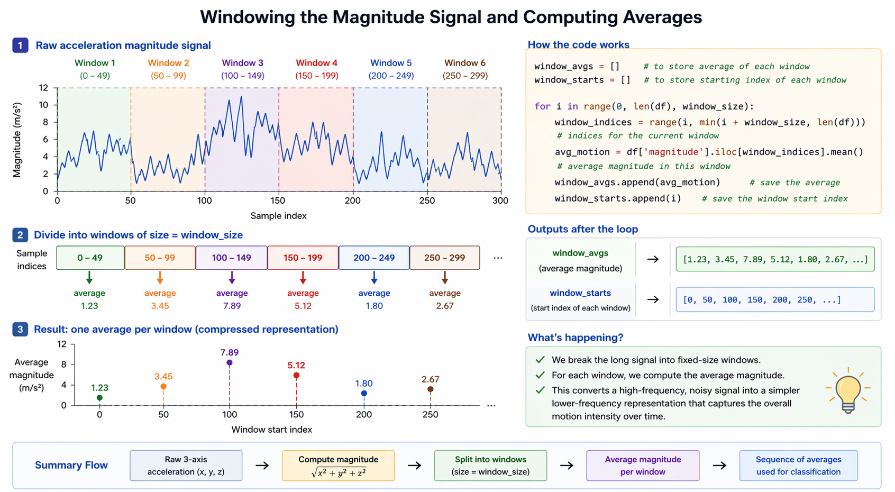
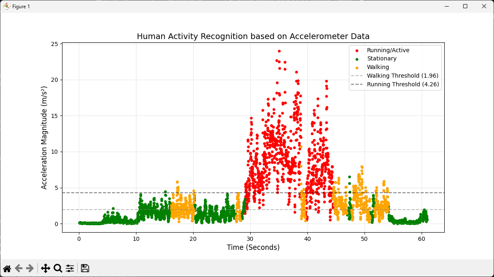
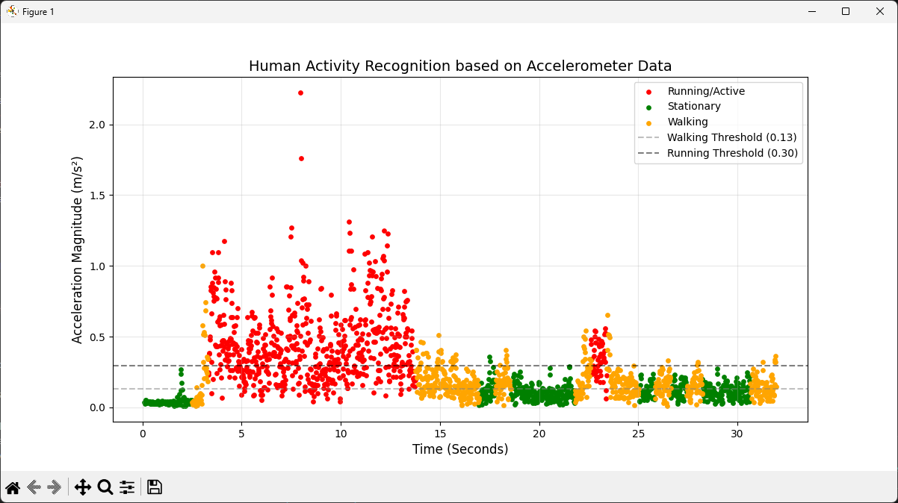

# Human Activity Recognition (HAR)

---

## 1. Problem & Idea

* Smartphones contain accelerometers (x, y, z)
* We can detect **human activity from motion**
* Goal:

  * Stationary
  * Walking
  * Running

---

## 2. Paper Key Idea (VERY IMPORTANT)

From the paper:

* Data collected from **29 users**
* Activities:

  * Walking, Jogging, Sitting, Standing, Stairs
* Data is **time-series → NOT usable directly**

### Solution in paper:

1. Divide data into **time windows (10 sec)**
2. Extract **features (43 features)**
3. Train ML models
4. Achieved **~90% accuracy** for walking/jogging

👉 Important concept:

> You don’t classify raw signal — you classify **windowed features**

---

## 3. Our Approach (Simplified Version)

Instead of ML → we used:

* Magnitude
* Window averaging
* Dynamic thresholds

### Magnitude Formula:

```python
magnitude = sqrt(x^2 + y^2 + z^2)
```

✔ Removes orientation problem

### 🔹 Paper vs Our Approach:

* Paper: Uses many features (43 features), such as:

  * Mean (average acceleration)
  * Standard deviation (variation of motion)
  * Average absolute difference
  * Resultant acceleration (magnitude)
  * Time between peaks (step frequency)
  * Binned distribution (value distribution)

* Us: Use only magnitude + simple statistics


---

## 4. Code — Step 1: Load Data

```python
df = pd.read_csv('accelerometer.csv')   
```

* Input: CSV from phone
* Contains:

  * x, y, z
  * time

### 🔹 Paper vs Our Approach:

* Paper: Collects labeled data from multiple users
* Us: Use recorded CSV data (single session analysis)

---

## 5. Code — Step 2: Magnitude

```python
df['magnitude'] = np.sqrt(df['x']**2 + df['y']**2 + df['z']**2)
```

* Converts 3D → 1D signal
* Matches paper concept: "resultant acceleration"



### 🔹 Paper vs Our Approach:

* Paper: Uses magnitude as **one feature among many**
* Us: Use magnitude as the **main signal for classification**

---

## 6. Code — Step 3: Windowing

```python
window_size = 50

for i in range(0, len(df), window_size):
    avg_motion = df['magnitude'].iloc[i:i+window_size].mean()
```

* Same idea as paper segmentation
* Paper uses 10 sec windows
* We use ~1 sec (lighter + real-time)



### 🔹 Paper vs Our Approach:

* Paper: Large windows (10 sec) for stable feature extraction
* Us: Small windows (~1 sec) for real-time responsiveness

---

## 7. Code — Step 4: Dynamic Thresholds

```python
motion_windows = [w for w in window_avgs if w >= noise_floor]

walking_threshold = np.percentile(motion_windows, 33)
running_threshold = np.percentile(motion_windows, 66)
```

**Why this is smart:**

* Adapts to user (personalized)
* No hardcoding (flexible)
* Inspired by data distribution

### 🔹 Paper vs Our Approach:

* Paper: Learns decision boundaries using ML models
* Us: Learn thresholds dynamically using percentiles

---

## 8. Code — Step 5: Classification

```python
if avg_motion < noise_floor:
    Stationary
elif avg_motion < walking_threshold:
    Stationary
elif avg_motion < running_threshold:
    Walking
else:
    Running
```

* Low → Stationary
* Medium → Walking
* High → Running

### 🔹 Paper vs Our Approach:

* Paper: Uses trained classifiers (Decision Tree, Logistic Regression, Neural Networks)
* Us: Use rule-based classification (thresholds)

---

## 9. Results (Your Data)

### Example 1:



* Clear separation:

  * Green → Stationary
  * Orange → Walking
  * Red → Running
* Threshold lines visible

---

### Example 2: Before Applying Noise Filtering & Adaptive Thresholds



* Raw signal without proper filtering
* Misclassification occurs
* Stationary data incorrectly detected as Walking/Running
* Noise interpreted as real motion

### 🔹 Paper vs Our Approach:

* Paper: Robust to noise due to feature extraction + training
* Us: Required explicit noise handling (noise floor + thresholds)

---

## 10. Key Insight:

### From Paper:

* Uses ML + many features → high accuracy

### Our Approach:

* Simple + fast
* Works without training
* Real-time friendly

---

## 11. Applications of Human Activity Recognition (HAR)

### Where Can This Be Used?

* **Fitness Tracking**

  * Monitor walking and running activity
  * Estimate activity levels and calories

* **Health Monitoring**

  * Track daily movement patterns
  * Detect inactive behavior

* **Smart Phone Adaptation**

  * Adjust phone behavior based on activity
  * Example: silent mode while running

* **Context-Aware Applications**

  * Apps respond to user activity automatically
  * Example: adaptive music or notifications

* **User Behavior Analysis**

  * Analyze activity trends over time
  * Useful for insights and analytics

---

### Key Advantage of Our Approach

* Lightweight and fast
* Works in real-time
* Suitable for mobile environments

---


---

## Final Conclusion

* HAR is possible using **only accelerometer**
* Paper proves high accuracy with ML
* Our solution:

  * Lightweight
  * Adaptive
  * Practical

---

> "We simplified a machine learning problem into a real-time adaptive thresholding system inspired by signal processing and data distribution."
